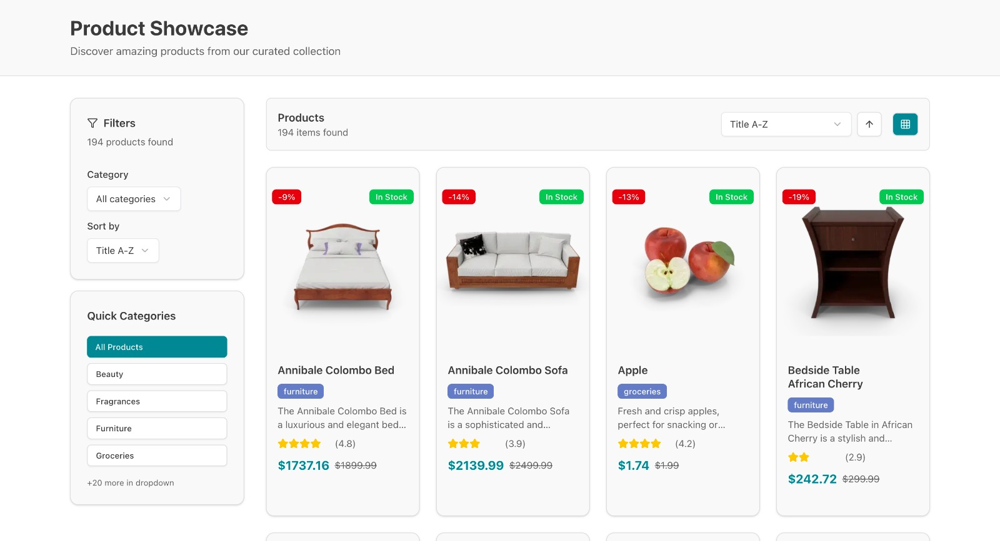
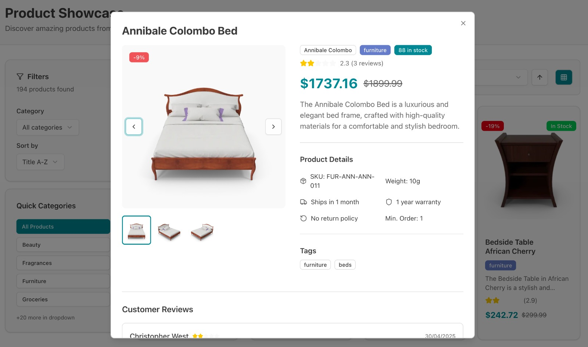

# 🛍️ Product Showcase Explorer

A responsive web application that allows users to browse, filter, and view details of products fetched from the [DummyJSON Products API](https://dummyjson.com/products).  Built with **Next.js**, **TypeScript**, and **Tailwind CSS**, with smooth animations powered by **GSAP**.


## Preview

👉 [Experiment it Live!](https://product-showcase-tau-ten.vercel.app/)
## Screenshots

### Product Page


### Product Detail Modal

## Core Features

- **Fetch & Display Products**
   - Products are fetched from the DummyJSON API.
   - Displayed in a responsive **grid of product cards**.
   - Pagination implemented using API parameters (`limit`, `skip`)

- **Product Detail View**
   - Clicking on a product opens a **modal detail view**.
   - Includes title, price, description, rating, stock, brand, category, and multiple images.

- **Filtering**
   - Products can be filtered by **category**.
   - Categories are fetched dynamically from the API.

- **Sorting**
   - Sort products by:
     - Price: Low → High / High → Low
     - Title: A–Z / Z–A

- **Loading & Error Handling**
   - animated loading spinner for loading states.
   - Friendly error messages for empty states and api failures.

- **Responsiveness**
   - Fully responsive across **mobile, tablet, and desktop**.


### 🎨 Animations (Framer Motion)

- **List Item Animations**: Staggered fade-in for product cards.  
- **Detail View Transition**: Smooth scaling + fade for modal.  


### 🚀 Bonus Implementations

- Implemented an **animated image gallery** inside the product detail modal.  
- Users can smoothly **switch between multiple images** with transitions.  
- Enhances the overall browsing experience.  

## Tech Stack

- **Framework**: [Next.js](https://nextjs.org/)  
- **Language**: TypeScript  
- **Styling**: Tailwind CSS and ShadCN UI
- **Animations**: GSAP  
- **API**: [DummyJSON Products API](https://dummyjson.com/products)  
- **Data Fetching**: Fetch API  


## Installation Guide

### ✅ Prerequisites

Before you begin, make sure you have:

- **Node.js** (v20 or later) – [Download](https://nodejs.org/)
- **npm** or **yarn**

### Clone the Repository

```bash
git clone https://github.com/lipika1911/product-showcase.git
```

### Install Dependencies

```bash
npm install
```

### Run the App

```bash
npm run dev
```

### ✅ You’re all set!
- Open http://localhost:3000 in your browser.